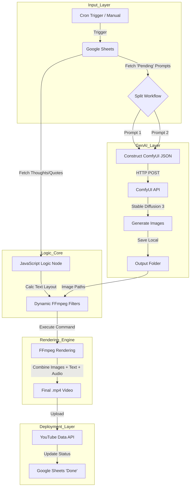

# 🎬 Autonomous GenAI Video Pipeline 

[](https://n8n.io/)
[](https://github.com/comfyanonymous/ComfyUI)
[](https://ffmpeg.org/)
[](https://developer.mozilla.org/en-US/docs/Web/JavaScript)
[](https://sheets.google.com)
[](https://developers.google.com/youtube/v3)

A fully automated **"Text-to-Video"** content factory. This pipeline orchestrates a complex workflow that reads prompts from a database, generates high-fidelity AI imagery via **Stable Diffusion (ComfyUI)**, programmatically animates and edits the video using **FFmpeg**, and automatically publishes the final result to **YouTube**.

-----

## 🏗️ System Architecture

The system operates as a closed-loop agent running inside a Dockerized environment. It connects local AI generation capabilities with cloud-based APIs.



-----

## Link to HiDream-ai Repository

Refer this HIDREAM library for models and files that needs to be loaded in comfy-ui for image generations. [HiDream-ai link](https://huggingface.co/HiDream-ai)

## 🚀 Workflow Logic & Node Breakdown

The pipeline is divided into **5 distinct stages**. Below is a detailed technical breakdown of how n8n processes data at each step.

### 🔹 Stage 1: Data Ingestion & Trigger

The workflow begins by checking a Google Sheet for new content ideas.

| Node Name | Type | Functionality |
| :--- | :--- | :--- |
| **Schedule Trigger** | `Trigger` | Runs automatically every **30 minutes** to check for new tasks. |
| **Get row(s)** | `G-Sheets` | Fetches rows where `Status` column is **"Pending"**. Retrieves `Prompt 1`, `Prompt 2`, and `Thoughts` text. |

### 🔹 Stage 2: Generative AI (ComfyUI Integration)

Instead of using expensive cloud APIs (like DALL-E), this workflow connects to a local **ComfyUI** instance via API.

| Node Name | Technology | Detailed Logic |
| :--- | :--- | :--- |
| **Prompt in JSON** | `JavaScript` | dynamically constructs a **ComfyUI Workflow JSON**. It injects the user prompt into a `CLIPTextEncode` node and generates a random 14-digit seed to ensure image uniqueness. |
| **Call ComfyUI** | `HTTP POST` | Sends the constructed JSON to `http://host.docker.internal:8188/prompt`. This triggers the Stable Diffusion generation on the local GPU. |
| **Wait Node** | `n8n Wait` | Pauses execution for **13 minutes** to allow the GPU to finish rendering high-resolution images. |
| **Get Image File** | `HTTP GET` | Queries the ComfyUI history endpoint to retrieve the generated filename and downloads the binary data. |

### 🔹 Stage 3: Dynamic Layout Calculation

To make the video professional, text overlays cannot be static. The system calculates how large the text box needs to be based on the length of the quote.

| Node Name | Technology | Logic Description |
| :--- | :--- | :--- |
| **Single line to Multi** | `JavaScript` | Wraps long text strings (word wrapping) to ensure they fit within the 1080px video width. Breaks long sentences into `\n` separated lines. |
| **Code (Layout Calc)** | `JavaScript` | **Key Logic:** Calculates the exact pixel height (`stripHeight`) and vertical position (`stripTop`) for the semi-transparent black background box. <br> *Formula:* `Height = (LineCount * 70px) + Padding`. |

### 🔹 Stage 4: Programmatic Video Editing (FFmpeg)

This is the powerhouse of the pipeline. It uses the `Execute Command` node to run a complex **FFmpeg** script that would typically require a human editor.

**The FFmpeg Filter Complex (`-filter_complex`):**

1.  **Loop & Fade:** Takes the 2 static images, loops them, and applies a cross-fade transition at the 7-second mark.
2.  **DrawBox:** Dynamically draws a semi-transparent black box (`color=black@0.5`) using the variables calculated in Stage 3 (`stripTopP1`, `stripHeightP1`).
3.  **DrawText:** Renders the text using the **Komet Bold** font. It includes specific **Alpha** animations (`alpha='if(lt(t,1)...'`) to make the text fade in and out synchronously with the scene changes.
4.  **Watermark:** Adds a permanent `@TheSilenceWithinStillness` watermark at the bottom.

### 🔹 Stage 5: Deployment & Cleanup

| Node Name | Type | Functionality |
| :--- | :--- | :--- |
| **Upload Video** | `YouTube` | Uploads the generated `.mp4` to YouTube with privacy status `Public`. Adds tags like `#Motivation`, `#Stoic`, and AI-generated descriptions. |
| **Update Row** | `G-Sheets` | Writes back to the Master Sheet, changing the status from **"Pending"** to **"Done"** to prevent duplicate uploads. |

-----

## 🛠️ Tech Stack & Requirements

| Component | Technology | Usage |
| :--- | :--- | :--- |
| **Orchestrator** | n8n (Self-Hosted) | Managing control flow, API calls, and logic. |
| **Image Engine** | ComfyUI | Running `SD3` (Stable Diffusion 3) and `GGUF` models. |
| **Video Engine** | FFmpeg | Command-line video editing, concatenation, and filtering. |
| **Scripting** | JavaScript (ES6) | Data transformation and JSON manipulation within n8n. |
| **Database** | Google Sheets | Lightweight CMS for prompt management. |
| **Infrastructure** | Docker | Containerization of n8n and communication via `host.docker.internal`. |

-----

## 💻 Sample Code Snippets

### 1\. Dynamic ComfyUI Payload Construction

*This JavaScript code generates a unique seed and constructs the API payload for the image generator.*

```javascript
// Function to generate a random 14-digit number for the seed
function generate14DigitRandomNumber() {
  const min = 10000000000000; 
  const max = 99999999999999; 
  return Math.floor(Math.random() * (max - min + 1)) + min;
}

const comfyUiWorkflow = {
  "168": {
    "inputs": {
      "noise_seed": generate14DigitRandomNumber(),
      "steps": 30,
      "cfg": 1.0,
      "sampler_name": "lcm",
      "model": ["171", 0],
      // ... linked nodes
    },
    "class_type": "KSamplerAdvanced"
  }
};
```

### 2\. The FFmpeg Command

*The command used to render the video with dynamic variables injected by n8n.*

```bash
ffmpeg -i "{{ $json.fullPath1 }}" -i "{{ $json.fullPath2 }}" -filter_complex "
  [0:v]loop=loop=-1:size=1,fade=t=in:st=0:d=2[v1];
  [1:v]loop=loop=-1:size=1,fade=t=in:st=0:d=2[v2];
  [v1][v2]concat=n=2:v=1:a=0[base];
  [base]drawbox=y={{ $json.stripTopP1 }}:h={{ $json.stripHeightP1 }}:color=black@0.5:t=fill[bg1];
  [bg1]drawtext=text='{{ $json.thoughtP1 }}':fontcolor=white:fontsize=50:alpha='if(lt(t,1),0,1)'[v]
" -t 20 -c:v libx264 -y "{{ $json.tempVideoPath }}"
```

-----
